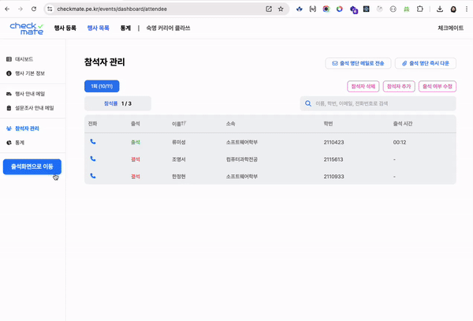
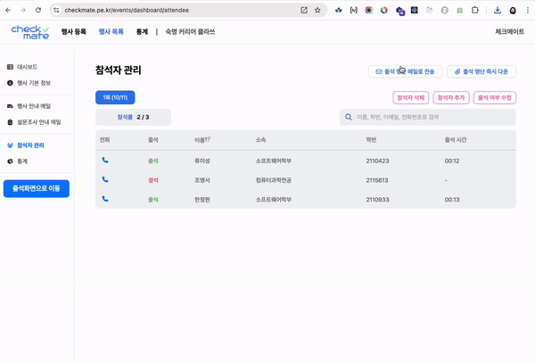

  <h1>CheckMate | 체크메이트</h1>
  
내 손 안에 간편한 행사 관리 시스템

## 🗂️ 목차

1. [**웹 서비스 소개**](#1)
2. [**개발 기간**](#2)
3. [**기술 스택 및 사용 라이브러리**](#3)
4. [**주요 기능 데모 영상**](#4)
5. [**개발 팀 소개**](#5)
6. [**버전 기록**](#6)
7. [**Git Convention**](#7)

 

## 💁🏻 웹 서비스 소개

행사 참석자들의 출석 확인을 쉽고 빠르게 하고, 주최자가 참석 이력을 효율적으로 관리할 수 있는 서비스를 제공한다.

 

## 📅 개발 기간

2024.05.05 ~ ing

 

 

## 💻 기술 스택 및 사용 라이브러리

### Front-end

    

### 버전 관리

 

### 배포 도구

 

### 라이브러리

|      라이브러리명      |    사용 목적     |                기능                |
| :--------------------: | :--------------: | :--------------------------------: |
| react-signature-canvas | 참석자 서명 구현 |  캔버스 관리 및 서명 데이터 처리   |
|        chart.js        |  통계 기능 구현  | 행사별 세부 통계 및 전체 통계 구현 |

 

## 🎥 주요 기능 데모 영상

|                                              온보딩 페이지                                               |
| :------------------------------------------------------------------------------------------------------: |
|  |

|                                                 행사 등록 페이지                                                 |
| :--------------------------------------------------------------------------------------------------------------: |
|  |

|                                       출석 체크 기능 (학번 입력 및 서명)                                       |
| :------------------------------------------------------------------------------------------------------------: |
|  |

|                                                  행사 목록 및 행사 상세 페이지                                                  |
| :-----------------------------------------------------------------------------------------------------------------------------: |
|  |

|                                                     참석자 명단 다운로드 기능                                                      |
| :--------------------------------------------------------------------------------------------------------------------------------: |
|  |

 

## 🏄🏻‍♀️ 개발 팀 소개

<table style="text-align:center">
  <thead>
    <tr>
      <th style="text-align: center;">프로필</th>
      <th style="text-align: center;">이름 (세부 전공)</th>
      <th style="text-align: center;">역할</th>
      <th style="text-align: center;">개발 내용</th>
    </tr>
  </thead>
  <tbody>
    <tr>
      <td></td>
      <td style="text-align: center;">류미성 (컴퓨터과학 21)</td>
      <td>Front-end</td>
      <td>출석체크 기능(학번/휴대폰번호 입력, 서명) 구현  온보딩 페이지 행사 목록 및 검색 기능 구현 행사 상세페이지 세부 통계 페이지</td>
    </tr>
    <tr>
      <td></td>
     <td style="text-align: center;">한정현 (컴퓨터과학 21)</td>
      <td>Front-end</td>
      <td>구글로그인 행사 등록 기능 구현 온보딩 페이지 전체통계 기능 구현</td>
    </tr>
    <tr>
      <td></td>
      <td style="text-align: center;">조영서 (컴퓨터과학 21)</td>
      <td>Back-end</td>
      <td>서비스 전반 기능 담당</td>
    </tr>
  </tbody>
</table>

 

## 👷 버전 기록

|   버전   | 
업데이트 내용
                                                                                                                      | 업데이트 날짜 |
| :------: | :----------------------------------------------------------------------------------------------------------------------------------------------------------- | :-----------: |
| `v1.0.0` | - 체크메이트 서비스 오픈 - 출석체크 기능 구현                                                                                                            |  24. 05. 12   |
| `v1.1.0` | - 출석체크 플로우 수정 (모달창 간소화) - 참석명단 조회 기능 추가                                                                                         |  24. 05. 19   |
| `v1.2.0` | - 참석명단 이메일로 전송 기능 추가                                                                                                                           |  24. 05. 25   |
| `v1.3.0` | - 반응형 구현 - 행사 상세 페이지 내 참석여부 확인 기능 구현  - 행사 참석자 전화 연결 기능 구현 - 행사 등록 페이지 구현                            |  24. 07. 11   |
| `v2.0.0` | - 대시보드 페이지 구현 (관리자 페이지)   - 휴대전화 뒷번호로 출석체크 하는 기능 구현   - 행사 진행 상태 표시                                        |  24. 07. 24   |
| `v2.1.0` | - 참석자 명단을 담당자 메일로 자동 발송 기능 구현                                                                                                            |  24. 07. 26   |
| `v2.1.1` | - 행사 등록 페이지 내 오류 해결                                                                                                                              |  24. 08. 16   |
| `v3.0.0` | - 행사 목록 페이지 생성  - 모든 페이지의 디자인 수정                                                                                                      |  24. 09. 05   |
| `v3.0.1` | - 행사별 세부 통계 및 전체 통계 기능 구현  - 행사 목록 검색 기능 구현   - 구글 로그인 구현  - 행사 리마인드 예약 발송, 설문조사 링크 발송 기능 구현 |  24. 09. 26   |

 

## 📌 Git Convention

### 🔵 Commit Convention

- `feat` : 새로운 기능 추가
- `fix` : 버그, 오류 해결
- `modify` : 코드 수정 (기능의 변화가 있을 때)
- `docs` : README나 WIKI 등의 문서 수정
- `remove` : 폴더 또는 파일 삭제, 쓸모없는 코드 삭제
- `rename` : 파일 이름 변경 또는 파일 이동시
- `refactor` : 기능 추가나 버그 수정이 없는 코드 변경 ( 코드 구조 변경 등의 리팩토링 )
- `style` : 코드 formatting, 세미콜론 누락, 코드 자체의 변경이 없는 경우
- `design` : CSS 등 사용자 UI 디자인 변경
- `test` : 테스트 코드, 리팩토링 테스트 코드 추가
- `chore` : src 또는 test 파일을 수정하지 않는 기타 변경 사항 ( 빌드/패키지 매니저 설정 변경 등 )
- `merge` : merge 하는 경우
- `!BREAKING CHANGE` : 커다란 API 변경의 경우
- `!HOTFIX` : 급하게 치명적인 버그를 고쳐야 하는 경우

### 커밋 예시

- git commit -m "#이슈번호 커밋 태그: 커밋 내용"
  - ex) `git commit -m "#198 feat: 회원가입 기능 구현"`

 

### 🔵 Branch Convention

- `main` : 최종 배포
- `dev` : 주요 개발, main merge 이전에 거치는 branch
- `feat` : 각자 개발, 기능 추가
- `fix` : 에러 수정, 버그 수정
- `docs` : README, 문서
- `refactor` : 코드 리펙토링 (기능 변경 없이 코드만 수정할 때)
- `modify` : 코드 수정 (기능의 변화가 있을 때)

### 브랜치 명 예시

- feat/#이슈번호-기능 이름
  - ex) `feat/#198-login`

 

### 🔵 Branch Strategy

- Git-flow 전략을 기반으로 `main`, `dev` 브랜치와 `feat` 보조 브랜치를 운용했습니다.
- `main`, `dev`, `feat` 브랜치로 나누어 개발을 하였습니다.
  - `main` 브랜치는 배포 단계에서만 사용하는 브랜치입니다.
  - `dev` 브랜치는 개발 단계에서 git-flow의 master 역할을 하는 브랜치입니다.
  - `feat` 브랜치는 기능 단위로 독립적인 개발 환경을 위하여 사용하고 merge 후 각 브랜치를 삭제해주었습니다.

 

### 🔵 Issue Convention

- `[공통]` : 공통적으로 적용되는 경우
- `[행사 전]` : 행사 전에 필요한 기능을 구현 하는 경우
- `[행사 당일]` : 행사 당일에 필요한 기능을 구현 하는 경우
- `[행사 후]` : 행사 후에 필요한 기능을 구현 하는 경우

### 이슈 명 예시

- [이슈 항목] 개발 내용
  - `ex) [공통] 홈화면 구현`

 
